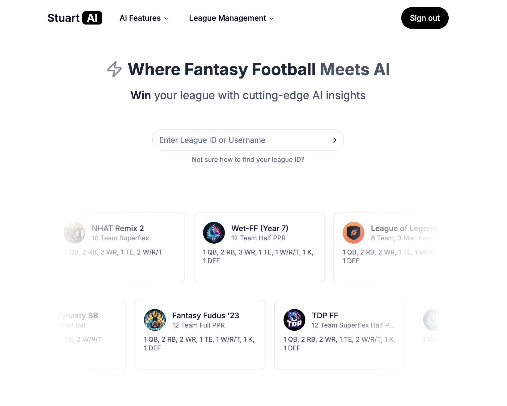
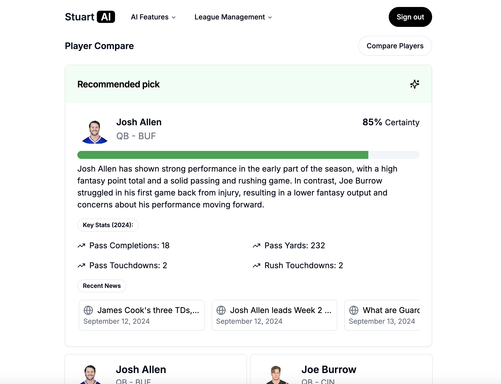
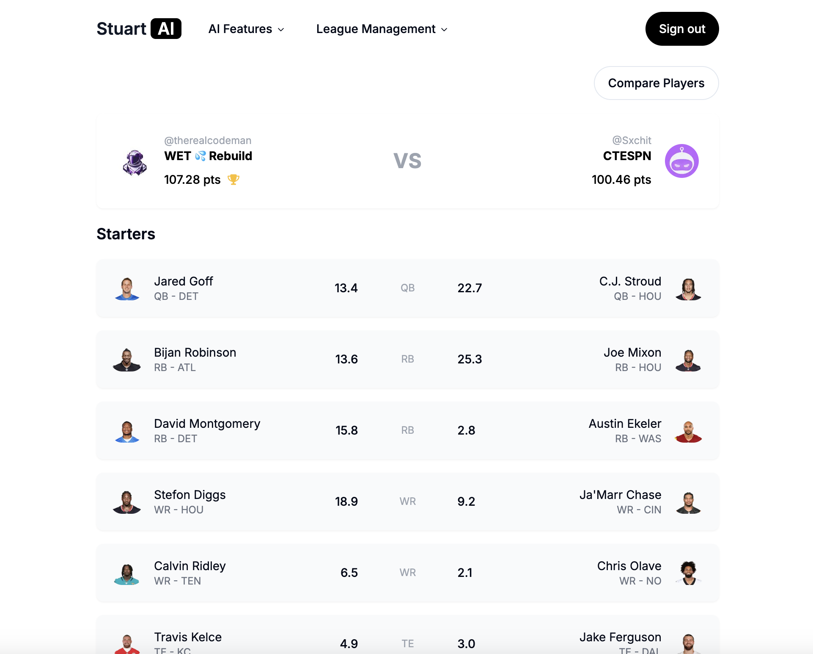

# Stuart AI

## A fully featured AI dashboard for fantasy football

## See your leauge matchups in real time

## Deployed with Vercel

https://sleeper-dashboard.vercel.app/

## Description

A full stack fantasy football dashboard with AI features. Built with Next.js, Jotai, Tailwind, ShadCN, and OpenAI, Vercel SDK, Sleeper API, Redis, MagicUI, node-cron Prisma, Postgres, and so much more. This project sets out to be a truly revolutionary fantasy football dashboard that will revolutionize the way fantasy football is played and analyzed. It will take into account recent news, historical data, trends, and other factors to provide accurate and reliable insights.

## Technologies

- ShadCN
- Jotai global state management
- Next.js
- Tailwind
- Sleeper API (fantasy football app)
- OpenAI
- Vercel
- MagicUI
- node-cron
- Prisma
- Postgres
- Redis

## Features

- AI-powered player comparison
- Real-time league matchups from your sleeper league
